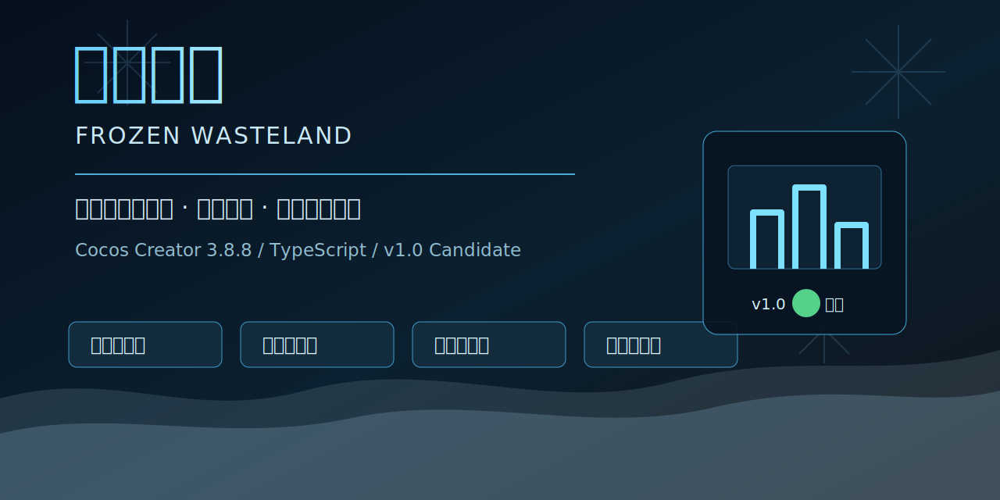

# 极寒末世 / Frozen Wasteland



> 中文：Cocos Creator 制作的末日避难所经营游戏。玩家需要在极寒天气中管理幸存者、燃料、食物、建筑、搜刮队和外部世界网络，让一个临时避难所逐步成长为能长期存活的聚落。
>
> English: A Cocos Creator survival-management game about building and maintaining a shelter in a frozen apocalypse. Manage survivors, fuel, food, construction, scavenging teams, and the outside world network as a temporary refuge grows into a long-term settlement.


## 中文说明

### 当前状态

`v1.0 Candidate`：核心玩法闭环已成型，正在做长测、数值和平衡打磨。当前版本适合试玩、代码审阅和继续开发，不代表最终商业发行版。

| 模块 | 状态 |
|---|---|
| 基础生存闭环 | 已成型，第一周 P0 逻辑烟测通过 |
| 搜刮系统 | 已有 8 个区域模板、战斗、事件、撤离和结算 |
| 基地经营 | 建造、供暖、温室、科技、载具、仓储可玩 |
| 存档读档 | 自动/手动存档、旧档兼容、坏档提示已加固 |
| 长线系统 | 世界影响力、外部哨站、生产链、聚落等级已有骨架 |
| 发行打磨 | 仍需实机长测、截图、音频、美术和最终平衡 |

### 玩法亮点

- **极寒生存压力**：室外温度、暴风雪、燃料消耗、室内热扩散和建筑保温共同影响幸存者生存。
- **避难所经营**：墙、门、床、管道、煤炉、锅炉、温室、工坊、无线电、炮塔、地热井等设施逐步解锁。
- **搜刮探索**：郊区、荒野、商业街、仓储区、医院、工厂、军事基地、研究所拥有不同地图结构、风险和掉落。
- **幸存者系统**：幸存者有健康、体温、士气、属性、特质、工作分配和关系状态。
- **长线目标**：从 Lv1 避难所成长为更稳定的雪原据点、地下聚落和新文明核心。
- **内置 QA 面板**：游戏内可查看 v1.0 完成度，快速执行测试包、快进、存读测试和一周烟测。

### 快速开始

环境：

- Windows
- Cocos Creator `3.8.8`
- Node.js 仅用于本地 TypeScript 静态检查，运行游戏主要通过 Cocos Creator 编辑器。

用 Cocos Creator 打开：

```text
game/NewProject1
```

入口场景：

```text
game/NewProject1/assets/main.scene
```

在 Cocos Creator 中点击预览即可运行。预览地址通常是：

```text
http://127.0.0.1:7456/
```

### 静态检查

在 `game/NewProject1` 目录执行：

```powershell
powershell -ExecutionPolicy Bypass -File ../../tools/qa/run-tsc.ps1
```

当前验证结果：项目 TypeScript 检查通过。

### 发布前烟测

在 `game/NewProject1` 目录执行：

```powershell
powershell -ExecutionPolicy Bypass -File ../../tools/qa/run-all.ps1
```

也可以单独运行：

```powershell
powershell -ExecutionPolicy Bypass -File ../../tools/qa/run-p0-smoke.ps1
```

该命令会运行第一周 P0 逻辑烟测，并确认烟测不会污染当前局或本地存档。

### 游戏内 QA

预览中打开 `基地 -> ✅完成度`，可以使用：

- `🧪 测试包`：加入一组 v1.0 验证用资源。
- `⏩ 快进7天`：执行真实每日结算的快进。
- `💾 存读测试`：写入本地存档并读取验证。
- `✅ 一周烟测`：临时演练第一周 P0 路线，结束后恢复当前局和本地存档。

浏览器控制台也提供：

```js
window._frostDebug.kit()
window._frostDebug.days(7)
window._frostDebug.roundtrip()
window._frostDebug.p0()
window._frostDebug.status()
```

### 项目结构

```text
.
├─ game/NewProject1/                 # Cocos Creator 3.8.8 主工程
│  ├─ assets/main.scene              # 入口场景
│  └─ assets/scripts/
│     ├─ GameManagerComp.ts          # DOM UI、输入、面板、预览调试入口
│     ├─ core/                       # 游戏核心系统
│     └─ data/                       # 类型、数据、故事
├─ docs/                             # 开发规格与计划
├─ 设计文档/                          # 玩法设计文档
├─ 开发计划.md
├─ 开发日志.md
├─ 进度总览.md
└─ CODEX.md                          # Codex 工作副本说明
```

### 路线图

- `v1.0`：稳定试玩版，完成第一周闭环、存档读档、搜刮闭环、仓库页面和发布说明。
- `v1.1`：强化中期世界网络，扩展哨站、生产链和势力事件。
- `v1.2`：补幸存者个人线、长期灾变、挑战剧本和多结局内容。
- `v2.0`：面向 80-100 小时长线目标的完整内容扩容。

详细版本计划见 [docs/VERSION_PLAN.md](docs/VERSION_PLAN.md)。

## English

### Current Status

`v1.0 Candidate`: the core loop is playable and the project is in long-play testing, balance tuning, and release-preparation mode. This version is suitable for playtesting, code review, and continued development, but it is not the final commercial release.

| Area | Status |
|---|---|
| Core survival loop | Implemented; the first-week P0 logic smoke test passes |
| Scavenging | 8 regional map templates, combat, events, evacuation, and settlement |
| Base management | Construction, heating, greenhouse, tech, vehicles, and storage are playable |
| Save/load | Auto/manual saves, old-save compatibility, and corrupted-save handling are hardened |
| Long-term systems | World influence, outposts, production chains, and settlement levels have a playable skeleton |
| Release polish | Still needs manual playtesting, screenshots, audio, art polish, and final balance |

### Highlights

- **Cold survival pressure**: outdoor temperature, blizzards, fuel consumption, indoor heat spread, and building insulation all affect survival.
- **Shelter management**: unlock and build walls, doors, beds, pipes, coal stoves, boilers, greenhouses, workshops, radios, turrets, and geothermal wells.
- **Scavenging and exploration**: suburbs, wilderness, commercial streets, storage zones, hospitals, factories, military bases, and research labs each have different layouts, risks, and loot.
- **Survivor simulation**: survivors have health, body temperature, morale, attributes, traits, work assignments, and relationships.
- **Long-term goals**: grow from a Lv1 shelter into a stable snowfield outpost, underground settlement, and new-civilization core.
- **Built-in QA panel**: inspect v1.0 completion status and run test kits, fast-forward tests, save/load checks, and first-week smoke tests in-game.

### Quick Start

Requirements:

- Windows
- Cocos Creator `3.8.8`
- Node.js is only needed for local TypeScript checks. The game is mainly run through the Cocos Creator editor.

Open this folder in Cocos Creator:

```text
game/NewProject1
```

Entry scene:

```text
game/NewProject1/assets/main.scene
```

Click Preview in Cocos Creator to run the game. The preview URL is usually:

```text
http://127.0.0.1:7456/
```

### Static Check

Run this from `game/NewProject1`:

```powershell
powershell -ExecutionPolicy Bypass -File ../../tools/qa/run-tsc.ps1
```

Current verification result: the project TypeScript check passes.

### Release Smoke Test

Run this from `game/NewProject1`:

```powershell
powershell -ExecutionPolicy Bypass -File ../../tools/qa/run-all.ps1
```

You can also run only the P0 smoke test:

```powershell
powershell -ExecutionPolicy Bypass -File ../../tools/qa/run-p0-smoke.ps1
```

This command runs the first-week P0 logic smoke test and verifies that the smoke test does not mutate the active game or local save.

### In-Game QA

Open `Base -> ✅ Completion` in the preview build:

- `🧪 Test Kit`: add a v1.0 verification resource pack.
- `⏩ Fast Forward 7 Days`: advance time while running real daily settlement logic.
- `💾 Save/Load Test`: write and read a local save.
- `✅ Week-One Smoke Test`: run a temporary P0 first-week route, then restore the active game and local save.

Browser console helpers:

```js
window._frostDebug.kit()
window._frostDebug.days(7)
window._frostDebug.roundtrip()
window._frostDebug.p0()
window._frostDebug.status()
```

### Project Layout

```text
.
├─ game/NewProject1/                 # Main Cocos Creator 3.8.8 project
│  ├─ assets/main.scene              # Entry scene
│  └─ assets/scripts/
│     ├─ GameManagerComp.ts          # DOM UI, input, panels, and preview debug hooks
│     ├─ core/                       # Core gameplay systems
│     └─ data/                       # Types, data, and story content
├─ docs/                             # Development specs and plans
├─ 设计文档/                          # Gameplay design documents
├─ 开发计划.md                         # Development plan
├─ 开发日志.md                         # Development log
├─ 进度总览.md                         # Progress overview
└─ CODEX.md                          # Codex workspace notes
```

### Roadmap

- `v1.0`: stable playtest build with the first-week loop, save/load, scavenging loop, repository page, and release notes.
- `v1.1`: improve the mid-game world network, outposts, production chains, and faction events.
- `v1.2`: expand survivor personal stories, long-term disasters, challenge scenarios, and endings.
- `v2.0`: expand toward an 80-100 hour long-term survival experience.

See the detailed version plan in [docs/VERSION_PLAN.md](docs/VERSION_PLAN.md).

## Release Notes / 发布说明

See [docs/RELEASE_NOTES_v1.0.md](docs/RELEASE_NOTES_v1.0.md).

## Development Records / 开发记录

- [进度总览.md](进度总览.md)
- [版本计划 / Version Plan](docs/VERSION_PLAN.md)
- [开发计划.md](开发计划.md)
- [开发日志.md](开发日志.md)
- [CODEX.md](CODEX.md)

## License / 许可

中文：当前仓库尚未选择开源许可证。若要公开发布并允许他人使用或修改代码，建议在发布前补充 `LICENSE`。

English: No open-source license has been selected yet. Add a `LICENSE` file before treating this repository as reusable by others.
